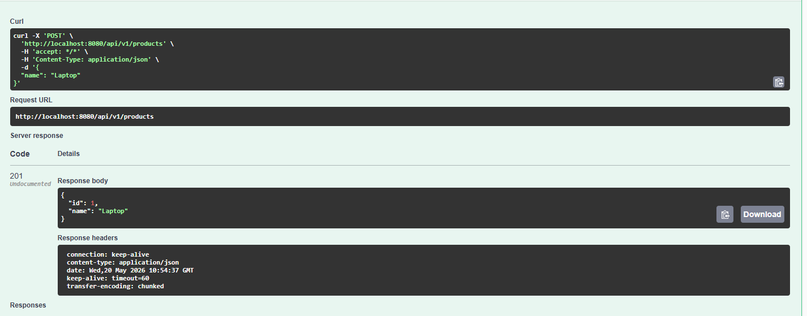
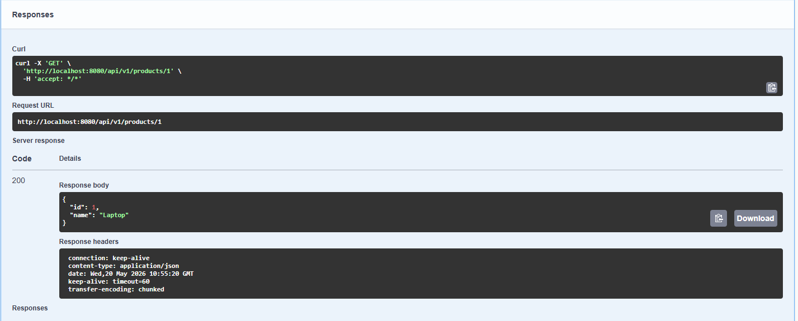
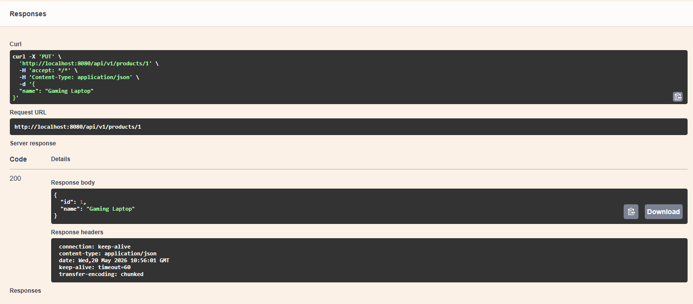
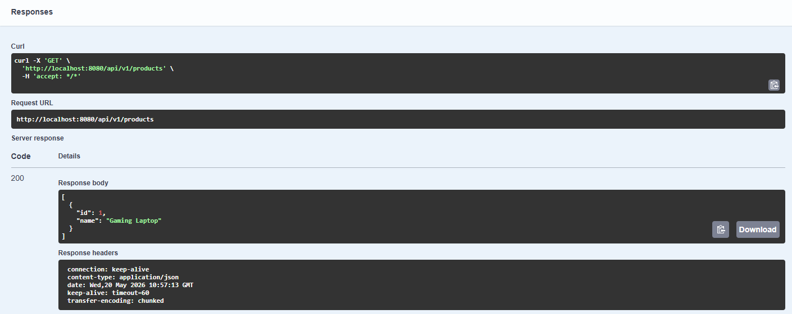
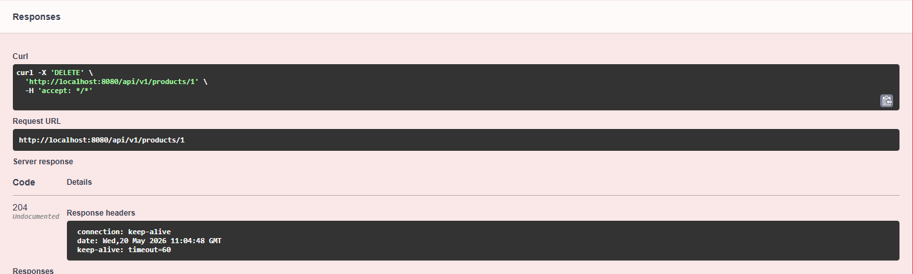
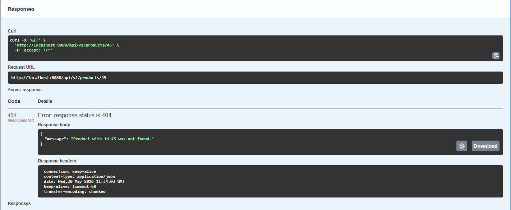

# Task 2: REST API Project

Student Name: Ronit Mirpuri
Project: FirstRestAPI

## Description
This project is a RESTful Web Service built using the **Spring Boot** framework. It provides a backend API for managing products. The application performs full CRUD operations (Create, Read, Update, Delete) and connects to an in-memory H2 database.

## Technologies Used
*   Java 17
*   Spring Boot 4.0.6
*   Spring Data JPA
*   H2 Database (In-Memory)
*   Maven
*   Lombok
*   Swagger UI (OpenAPI)

## How to Run the Application
1.  Clone the repository.
2.  Open the project in IntelliJ IDEA.
3.  Run the `FirstRestApiApplication.java` main class.
4.  The application will start on port `8080`.

## API Documentation (Swagger UI)
Once the application is running, access the interactive documentation here:
`http://localhost:8080/swagger-ui/index.html`

---

## API Endpoints and Screenshots

### 1. Create Product (POST)
Creates a new product in the database.
*   **URL:** `POST /api/v1/products`
*   **Request Body:**
    ```json
    {
      "name": "Laptop"
    }
    ```
*   **Screenshot:**
    

### 2. Get Single Product (GET)
Retrieves a specific product by its ID.
*   **URL:** `GET /api/v1/products/1`
*   **Screenshot:**
    

### 3. Update Product (PUT)
Updates the name of an existing product.
*   **URL:** `PUT /api/v1/products/1`
*   **Request Body:**
    ```json
    {
      "name": "Gaming Laptop"
    }
    ```
*   **Screenshot:**
    

### 4. Get All Products (GET)
Retrieves a list of all products currently in the database.
*   **URL:** `GET /api/v1/products`
*   **Screenshot:**
    

### 5. Delete Product (DELETE)
Deletes a product from the database by ID.
*   **URL:** `DELETE /api/v1/products/1`
*   **Screenshot:**
    

---

## Exception Handling

The application handles errors gracefully. If a client requests a product that does not exist, a custom error message is returned instead of a generic server error.

*   **Scenario:** Requesting ID `999` (which does not exist).
*   **Status Code:** 404 Not Found
*   **Screenshot:**
    

---

## Database Configuration

The application uses an **H2 In-Memory Database**. Data is stored in memory while the application is running.
*   **JDBC URL:** `jdbc:h2:mem:testdb`
*   The database schema is automatically generated by Hibernate (`ddl-auto`).
*   Database connectivity is verified by the successful execution of the POST, GET, PUT, and DELETE operations shown above.
